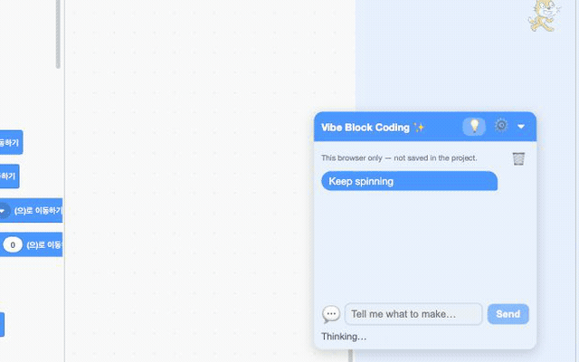

# Vibe Block Coding

Kids build with words and refine with blocks. An AI plus block-coding tool for two-way editing, built on Scratch.

**▶ [Try it live](https://vibe-app-drab.vercel.app/).** No signup, no API key. Type a sentence, watch blocks appear, run it.



## What it is

A child describes what they want in plain language ("make the cat spin forever and say hi"). The AI turns that into real Scratch blocks on the canvas. The child can then keep talking to change it, or grab the blocks and edit them by hand. Both directions stay in sync.

The point is not to let the AI do the work. It is to give a child a running program they can read, and then take apart. AI writes the first draft; the child understands it and makes it theirs. That is the two-way loop: words to blocks, blocks back to words.

## Why two-way

The common worry about AI in learning is that it does the thinking for you. Here the AI output *is* the lesson. Every generated script is standard Scratch: the child sees the loops, the waits, the motion blocks, and can drag them around, change the numbers, or ask for a change in words. Nothing is hidden behind a prompt box.

## Features

- **Talk to build.** A sentence becomes a script of real blocks on the stage.
- **Talk to edit.** Ask for a change and only the relevant blocks change. The rest of the program stays put, so commands accumulate instead of overwriting each other.
- **Loops.** `repeat` and `forever` with nested blocks, so a first program can already animate.
- **Chat history.** Past turns are kept with a live preview of the blocks each one produced.
- **Resizable cards.** Drag the panel and the block previews to any size, on mouse or touch.
- **It stays Scratch.** Generated blocks are normal Scratch blocks. Edit them by hand any time.

## Connection modes

Pick how the app reaches the language model. Set it once in the panel; it is saved in the browser.

| Mode | What it does | Needs |
|---|---|---|
| **Free** | Sends requests through a small hosted proxy that holds the key. Zero setup. | Nothing. This is the default and what the live demo uses. |
| **Bring your own key** | Calls the Anthropic API directly from the browser with your own key. | An Anthropic API key, stored only in your browser. |
| **Custom server** | Posts to a URL you supply, with an optional bearer token. | Your own endpoint. |

The free proxy forces a cheap model and applies daily and per-IP limits, so the shared demo stays affordable.

## Run it locally

Requires Node 18 (`.nvmrc` pins `18.20.8`).

```bash
nvm use
npm install
NODE_OPTIONS=--openssl-legacy-provider npm start
```

Open <http://localhost:8601>. The app starts in Free mode, so it works without a key.

## How it works

```
generate:  words  →  LLM  →  DSL  →  compile   →  blocks  →  stage
edit:      blocks →  DSL  →  LLM (change) → DSL diff → apply changed blocks
```

A small intermediate language (the DSL) sits between the model and Scratch. The model reads and writes the DSL; the app compiles it to blocks and decompiles blocks back to it. The edit path sends only a diff, and each change carries a fingerprint of the script it targets, so a wrong or stale reference is dropped rather than deleting the wrong blocks.

Our code lives in one place, `src/lib/ai-harness/`, kept separate from the Scratch codebase to stay reusable and easy to merge upstream:

| Module | Role |
|---|---|
| `dsl.js` | Compile DSL to blocks, decompile blocks to DSL (round-trip). |
| `llm.js` | Build prompts, call the model, parse and validate the returned DSL. |
| `edit.js` | Diff old and new DSL, apply only the changed scripts by fingerprint. |
| `endpoint-store.js`, `key-store.js` | Connection mode, endpoint, and key, stored in the browser. |
| `history-store.js`, `chat-store.js` | Chat turns and their block previews. |
| `dsl-to-blockly-xml.js` | Render block previews for the history cards. |

The one place we touch Scratch itself is a two-line mount in `src/components/gui/gui.jsx` and a dev hook in `src/reducers/vm.js`.

## Tech and license

Built as a fork of [scratch-gui](https://github.com/scratchfoundation/scratch-gui) (Scratch 3.0) and React, with a language model behind the connection modes above.

Scratch is a project of the Scratch Foundation. Because scratch-gui is licensed under the GNU AGPL v3, this fork is too. See [`LICENSE`](LICENSE).

## Contributing

Issues and pull requests are welcome. Run it locally with the steps above, and keep new AI code under `src/lib/ai-harness/` so it stays separable from Scratch. A full contributor guide is on the way.
